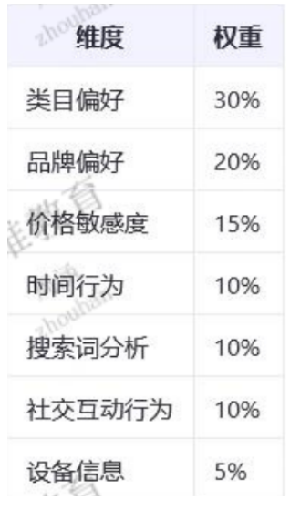

一.标签:基础特征包括年龄、性别、年代、身高、体重、星座 6 类标签
二.指标 :
  1. 用户年龄指标：以年龄段区间呈现，涵盖 18 - 24 岁、25 - 29 岁、30 - 34 岁、35 - 39 岁、40 - 49 岁、50 岁以上这 6 个类别。其判定需依据出生年份，若无则借助商品类目偏好、品牌偏好、价格敏感度、时间行为、搜索词分析、社交互动行为、设备信息等多维度数据加权计算，每日基于近 30 天行为数据更新。

  2.用户性别指标：分为女性用户、男性用户和家庭用户。通过用户在女性、男性相关品类的购买、加购、收藏、浏览行为及相应权重计算得分来判定，每日依近 30 天行为数据动态更新。

  3.用户体重指标：以千克为单位，数据源于订单信息、设备同步数据、活动表单等。经单位转换、异常值剔除等处理，按数据来源优先级确定最终值，每日凌晨拉取更新。

  4.用户身高指标：精确到厘米，数据来自个人信息身体数据、服饰 / 鞋类尺码选择、客服工单系统、智能硬件数据、实名认证信息等。经异常值过滤、多源数据加权处理，不同数据来源更新频率各异。

  5.星座指标：依据用户生日信息解析为十二星座，如白羊座（3 月 21 日 - 4 月 19 日）等。用户修改生日实时更新，每日凌晨全量更新 。

三.指标探源 ：

**年龄主题:**

①　类目: yes  base_category1.name ,   base_category2.name ,base_category3.name

②　品牌 : yes   base_trademark.tm_name

③　价格 : yes    order_detail.split_total_amount

④　时间行为 :yes   order_info.create_time

⑤　搜索词 :yes  page 日志 条件 page [‘last_page_id’] =’search’  and  page [‘item_type’]=’keyword’  

⑥　社交行为 : no

⑦　设备信息 : 日志 common[‘md’]

计算方法 :

得分乘以权重

更新频率为每日计算最近三十天数据

**性别主题:**

①　女性相关品类、男性相关品类、家庭相关品类:

base_category1.name

如何辨别：

女装/女士精品、女鞋、美容护肤/美体/精油、女士内衣/男士内衣/家居服、饰品/流行首饰/时尚饰品新、孕妇装/孕产妇用品/营养、童鞋/婴儿鞋/亲子鞋、童装/婴儿装/亲子装、尿片/洗护/喂哺/推车床等（女性相关品类）。

男装、流行男鞋、男鞋、运动服/休闲服装、运动鞋、网游装备/游戏币/帐号 /代练、电玩/配件/游戏/攻略等（男性相关品类）。

家居用品、厨房电器、生活电器、收纳整理、居家布艺、家庭保健、儿童用品等（家庭相关品类）。

②　购买行为、加购 / 收藏行为、浏览行为字段来源：主要来源于电商平台的用户行为日志系统。该系统会实时记录用户在平台上的每一次操作，包括用户在浏览商品页面、将商品添加到购物车（加购）、收藏商品以及最终购买商品时的详细信息。这些行为数据被精准捕捉并存储在数据库中，以便后续进行分析和计算，从而为判断用户性别提供有力依据。

③　行为时间戳字段来源：同样由电商平台的行为日志系统生成。在记录用户的购买、加购 / 收藏、浏览等行为的同时，系统会自动记录下每个行为发生的具体时间，精确到秒甚至更细的时间粒度。这个时间戳信息不仅可以反映用户行为的先后顺序，还能用于分析用户行为的活跃度和时效性，帮助更准确地判断用户的性别倾向。

行为得分计算：针对每个用户，分别计算其在女性相关品类和男性相关品类的行为得分。女性得分的计算公式为：女性得分 = Σ(购买行为 ×50% + 加购 / 收藏行为 ×30% + 浏览行为 ×20%)× 对应品类权重。例如，若用户购买女性相关品类商品的行为频繁，在计算女性得分时，购买行为这一项乘以 50% 后会产生较大数值，对最终得分影响较大；加购 / 收藏、浏览行为也会按照相应权重计入总分。男性得分计算方式同理，只是品类对应男性相关品类。

用户类型判定：依据计算出的女性得分和男性得分进行用户类型判断。若男性得分大于女性得分加上 10%，则判定该用户为男性用户；若女性得分大于男性得分加上 10%，则判定为女性用户。当用户的购买行为覆盖男女相关品类，并且女性得分小于等于 10% 时，将其归类为家庭用户 。

**年代主题** : 待定

**星座主题 ：**

①　星座 :yes user_info.birthday

#### **星座****字段****合规:**

摩羯座（12 月 22 日～1 月 19 日）

水瓶座（1 月 20 日～2 月 18 日）

双鱼座（2 月 19 日～3 月 20 日）

白羊座（3 月 21 日～4 月 19 日）

金牛座（4 月 20 日～5 月 20 日）

双子座（5 月 21 日～6 月 21 日）

巨蟹座（6 月 22 日～7 月 22 日）

狮子座（7 月 23 日～8 月 22 日）

处女座（8 月 23 日～9 月 22 日）

天秤座（9 月 23 日～10 月 23 日）

天蝎座（10 月 24 日～11 月 22 日）

射手座（11 月 23 日～12 月 21 日）

②　用户id :user_info.id

更新频率 ：实时更新 用户更改完之后 触发计算

如没有生日日期则标注:没有日期

**体重主题 :** no

**身高主题 :** no